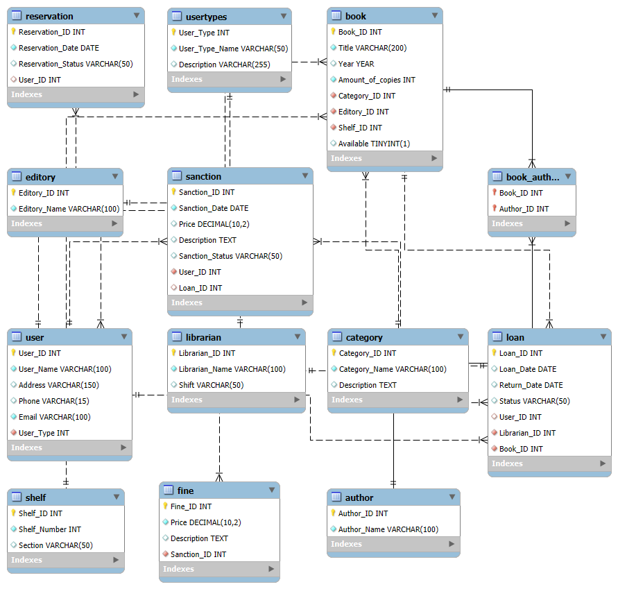

# BIBLIOTECA

Segunda preentrega - Curso SQL. 

### Descripción del proyecto
Esta biblioteca enfrenta ineficiencias tanto en la gestión del inventario como en el control de usuarios, préstamos y sanciones, lo que afecta negativamente tanto la operación interna como la experiencia del usuario. Estos problemas limitan la capacidad de la biblioteca para ofrecer un servicio ágil, confiable y personalizado a sus usuarios, lo que justifica la implementación de un sistema automatizado basado en una base de datos para optimizar todos estos aspectos.

Por lo tanto este proyecto consta de la creación de una base de datos para una biblioteca pública con el objetivo de modernizar su operación, mejorar la eficiencia, optimizar el uso de los recursos y brindar un mejor servicio a los usuarios. Además, facilita la toma de decisiones informadas sobre la colección de libros y las necesidades de los usuarios, y contribuye a la organización y gestión general de la biblioteca.

### Base de datos

En referencia a lo mencionado anteriormente, esta base de datos se creará para poder agilizar algunos de sus procesos, lograr una mejor organización y mejorar la experiencia de usuario. Se realizó una breve actualización con respecto a la primera preentrega agregando la tabla USERTYPES

A continuación se detallan cada una de las tablas: 

    1. User
        Objetivo: almacenar información de cada uno de los usuarios que reservan libros. 
        Atributos:
            User_ID (PK)
            User_Name
            Address
            Phone
            Email
            User_type
    2. UserTypes:
       Objetivo: poder diferenciar a los diferentes tipos de usuarios para poder luego permitire o restingirles ciertas acciones.
       Atributos: 
            User_Type (PK)
            User_Type_Name
            Description
    2. Book
        Objetivo: almacenar información de cada uno de los libros disponibles.
        Atributos: 
            Book_ID (PK)
            Title
            Year
            Amount_of_copies
            Cateogry_ID (FK)
            Editory_ID(FK)
            Shelf_ID (FK)
    3. Loan
        Objetivo: almacenar información sobre los prestamos realizados.
        Atributos:
            Loan_ID (PK)
            Loan_Date
            Return_Date
            Status
            User_ID (FK)
            Librarian_ID (FK)
    4. Librarian
        Objetivo: almacenar información de los trabajadores. 
        Atributos: 
            Librarian_ID (PK)
            Librarian_Name
            Shift
    5. Reservation
        Objetivo: almacenar información sobre las reservas de los libros.
        Atributos: 
            Reservation_ID (PK)
            Reservation_Date
            Reservation_Status
            User_ID (FK)
    6. Sanction
        Objetivo: almacenar información sobre las saciones aplicadas.
        Atributos: 
            Sanction_ID (PK)
            Sanction_Date
            Price
            Description
            Sanction_Status
            User_ID (FK)
            Loan_ID (FK)
    7. Fine
        Objetivo: almacenar información sobre las multas aplicadas.
        Atributos:
            Fine_ID (PK)
            Price
            Description
            Penalty_ID (FK)
    8. Category
        Objetivo: almacenar información sobre las categorías de libros disponibles.
        Atributos:
            Cateogry_ID (PK)
            Category_Name
            Description
    9. Editory
        Objetivo: almacenar información sobre las editoriales disponibles.
        Atributos:
            Editory_ID (PK)
            Editory_Name 
    10. Autor 
        Objetivo: almacenar información sobre los autores.
        Atributos: 
            Autor_ID (PK)
            Autor_Name
    11. Shelf
        Objetivo: almacenar información sobre los estantes.
        Atributos:
            Shelf_ID (PK)
            Shelf_number
            Section

### Archivos

#### Population

Este archivo, llamado "population," contiene un script SQL que inserta datos en varias tablas de la base de datos "Library". La razón de crear este archivo es para poblar la base de datos con datos iniciales y de prueba, lo cual es esencial para validar que la estructura de la base de datos y las relaciones entre las tablas funcionan correctamente.

#### Views

El archivo "views" tiene como propósito definir varias vistas de la base de datos. Estas vistas son consultas almacenadas que simplifican el acceso a datos complejos y permiten a los usuarios realizar consultas sin necesidad de conocer la estructura completa de las tablas. Detallo brevemente el objetivo de cada vista creada: 

    1. UserDetails: Proporciona un acceso fácil a los detalles de los usuarios junto con su tipo. Esto es útil para obtener una visión completa de cada usuario sin tener que realizar múltiples uniones cada vez que se necesite esta información.

    2. AvailableBooks: Muestra todos los libros que están disponibles para préstamo. Esto es útil para los usuarios que buscan libros para leer sin necesidad de filtrar manualmente en una tabla más extensa.

    3. UserLoans: Lista todos los préstamos de libros realizados por los usuarios, junto con los detalles del usuario y del libro. Facilita el seguimiento de préstamos por parte de cada usuario, lo que es esencial para la gestión de la biblioteca.

    4. LibrarianStats: Proporciona estadísticas sobre los bibliotecarios, como el número de libros que han sido prestados por cada uno. Esto puede ser útil para evaluar el desempeño de los bibliotecarios y optimizar su carga de trabajo.

    5. UserTypeSummary: Muestra un resumen del número total de usuarios por tipo. Esto permite una comprensión rápida de la demografía de los usuarios de la biblioteca, lo que puede influir en decisiones de gestión y marketing.

    6. CategoryBookCount: Lista las categorías de libros junto con la cantidad total de libros en cada categoría. Esto es importante para la gestión de inventarios y para ayudar a los usuarios a encontrar libros en una categoría específica.

    7. BookCategorySummary: Proporciona un resumen del número de libros por categoría, junto con la cantidad de préstamos realizados. Esto permite ver no solo cuántos libros hay, sino también qué categorías son más populares.

    8. PopularBooks: Muestra los libros más prestados, ordenados por la cantidad de veces que se han prestado. Esto es útil para identificar qué libros son los más atractivos para los usuarios.

    9. OverdueLoans: Muestra los préstamos que están atrasados, junto con la información del usuario y del libro. Esto es esencial para la gestión de sanciones y el seguimiento de los libros no devueltos.

#### Functions
Este archivo contiene varias funciones definidas por el usuario para realizar cálculos y operaciones específicas en la base de datos library. A continuación, se explica la razón detrás de cada función definida:

    1. GetUserLoanCount: 
        Objetivo: Contar el número total de préstamos realizados por un usuario específico.
        Razón: Esta función facilita la obtención del número de libros que un usuario ha prestado, lo cual es útil para el seguimiento de la actividad de préstamo y para gestionar las cuentas de los usuarios.

    2. IsBookAvailable:
        Objetivo: Determinar si un libro específico está disponible para préstamo.
        Razón: Permite verificar la disponibilidad de un libro de manera rápida y sencilla. Esto es fundamental para el sistema de gestión de la biblioteca, ya que los usuarios pueden querer saber si pueden tomar un libro sin tener que buscar en la base de datos cada vez.

    3. GetLateFees:
        Objetivo: Calcular y devolver las tarifas por atraso para un préstamo específico.
        Razón: Esta función es útil para gestionar las sanciones asociadas con los préstamos de libros. Al calcular las tarifas de manera automática, se simplifica la gestión de cuentas y se mejora la experiencia del usuario al saber exactamente cuánto debe si devuelve un libro tarde.

    4. GetTotalBooksInCategory:
        Objetivo: Obtener el total de libros en una categoría específica.
        Razón: Ayuda a entender la cantidad de libros disponibles en cada categoría, lo que es importante tanto para la gestión de inventarios como para los usuarios que buscan libros en un área específica de interés.

    5. GetPopularBooks:
        Objetivo: Devuelve el total de libros en una categoría específica.
        Razón: Sería útil para identificar cuáles son los títulos más populares dentro de la biblioteca, ayudando en la toma de decisiones sobre adquisiciones futuras y promociones.

#### Triggers
Este archivo incluye varios triggers que se utilizan para implementar lógica de negocio específica en la base de datos. Explicación de cada uno de ellos y su importancia:

    1. BeforeInsertLoan:
        Objetivo: Asegurarse de que un libro esté disponible antes de permitir un nuevo préstamo. Si el libro no está disponible, la inserción se cancela.
        Razón: Este trigger previene que se realicen préstamos de libros que ya están prestados, evitando confusiones y asegurando que la información sobre la disponibilidad del libro sea precisa.

    2. AfterUpdateUser:
        Objetivo: Registrar cada vez que se actualiza el nombre de un usuario en una tabla de auditoría.
        Razón: Este trigger es esencial para llevar un registro de cambios importantes en la base de datos. La auditoría permite rastrear modificaciones, lo que es crucial para la seguridad y la integridad de los datos, especialmente en situaciones donde la trazabilidad es necesaria.

    3. BeforeDeleteBook:
        Objetivo: Prohibir la eliminación de un libro que todavía está prestado, asegurando que no se puedan borrar libros que están en uso.
        Razón: Este trigger protege la integridad de los datos. Evita la eliminación accidental de libros que aún están en circulación, lo que podría llevar a inconsistencias en los registros de préstamos y complicar la gestión de la biblioteca.

    4. AfterInsertLoan:
        Objetivo: Actualizar la fecha de devolución automáticamente al insertar un nuevo préstamo (por ejemplo, si los préstamos son por 14 días).
        Razón: Este trigger automatiza el cálculo de la fecha de devolución, lo que reduce la posibilidad de errores manuales y asegura que la información sea coherente y esté actualizada.

    5. BeforeUpdateLoan:
        Objetivo: Asegurarse de que la fecha de devolución no se actualice a una fecha anterior a la fecha de préstamo.
        Razón: Este trigger garantiza la validez de las fechas en los registros de préstamos, evitando que se introduzcan datos incorrectos que puedan causar confusión o errores en el cálculo de tarifas por atraso.

#### Store Procedures
El archivo contiene funciones que encapsulan lógica de negocio en la base de datos, permitiendo realizar operaciones complejas con un solo comando. Explicación detallada: 

    1. AddNewBook:
        Objetivo: Agregar un nuevo libro a la base de datos, asegurando que se proporciona toda la información necesaria.
        Razón: Este procedimiento simplifica el proceso de inserción de un libro, permitiendo que se realice en una sola llamada, lo que reduce la posibilidad de errores al insertar datos.

    2. LoanBook:
        Objetivo: Procesar un nuevo préstamo de libro, verificando la disponibilidad y registrando la fecha de préstamo.
        Razón: Este procedimiento encapsula la lógica de negocio relacionada con los préstamos de libros, como verificar la disponibilidad antes de registrar el préstamo. Esto asegura que no se presten libros que ya están prestados, mejorando la integridad de los datos.

    3. ReturnBook:
        Objetivo: Procesar la devolución de un libro, actualizando la fecha de devolución en la tabla de préstamos.
        Razón: Este procedimiento simplifica el proceso de devolución al proporcionar una forma estandarizada de actualizar la información en la base de datos, lo que reduce la posibilidad de errores y garantiza que la fecha de devolución se registre correctamente.

    4. GetUserLoans:
        Objetivo: Obtener todos los préstamos de un usuario específico, devolviendo resultados en un conjunto de resultados.
        Razón: Este procedimiento facilita la recuperación de información sobre los préstamos de un usuario en particular, encapsulando la consulta SQL en un solo procedimiento que puede ser llamado desde diferentes partes de la aplicación. Esto mejora la reutilización del código y hace que sea más fácil mantener la lógica de consulta.

    5. GetPopularBooks:
        Objetivo: Obtener los libros más prestados, utilizando un parámetro para limitar la cantidad de resultados.
        Razón: Este procedimiento permite obtener información sobre la popularidad de los libros de manera eficiente, facilitando el análisis de datos y ayudando en la toma de decisiones sobre adquisiciones o promociones en la biblioteca.

### Diagrama ER 

## Authors

- [@belenamiune](https://www.github.com/belenamiune)

